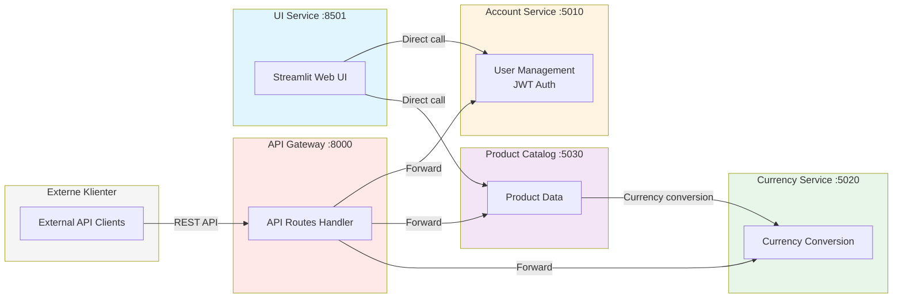

# API Gateway

API Gateway fungerer som simpel central indgangspunkt for alle microservices i Shopping Site applikationen. Håndterer request routing.

## Funktionalitet

- **Request Routing**: Dirigerer requests til korrekte microservices
- **Unified API**: Giver et ensartet API interface for alle services
- **Simple Proxy**: Kalder services direkte og returnerer responses
- **JWT Token Forwarding**: Videregiver Bearer tokens i Authorization header

**Note**: UI Service kalder mikroservices direkte - API Gateway er et alternativt indgangspunkt til systemet.

## API Endpoints

### Account Service Routes (prefix: `/api/account`)
- **POST /api/account/profile** - Registrer ny bruger
- **GET /api/account/profile** - Hent brugerprofil
- **PUT /api/account/profile** - Opdater brugerprofil
- **POST /api/account/login** - Login
- **POST /api/account/logout** - Logout

### Product Service Routes (prefix: `/api/products`)
- **GET /api/products** - Hent alle produkter
- **GET /api/products/:id** - Hent specifikt produkt
- **GET /api/products/search?title=...** - Søg produkter
- **GET /api/products/category/:name** - Produkter efter kategori

### Currency Service Routes (prefix: `/api/currency`)
- **POST /api/currency/convert** - Konverter valuta

## Service URLs (Internal)

Gateway kommunikerer med services via Docker network:
- **Account Service**: `http://acc:5000`
- **Currency Service**: `http://cur:5000`
- **Product Service**: `http://products:5000`

## Response Handling

Gateway returnerer responses direkte fra services:
- Status koder videresendes fra de underliggende services
- JSON responses returneres som de modtages

## Kørsel

```bash
python app.py
```

Gateway kører på port 5000 som standard.

## Docker Deployment

Gateway eksponeres på port 8000 i docker-compose setup:
- Ekstern adgang: `http://localhost:8000`
- Internal Docker network: `http://gateway:5000`

## Teknologi

- **Framework**: Flask
- **HTTP Client**: Requests library
- **Features**:
  - Simple service calls
  - JSON data proxying
  - Query parameter handling
  - Response status forwarding

## Arkitektur Diagram



**To indgangspunkter:**
1. **UI Service** (primær) - Kalder Account og Product services direkte
2. **API Gateway** (alternativ) - REST API for eksterne klienter

## Noter

- Gateway kalder services direkte uden kompleks fejlhåndtering
- JWT Bearer tokens videregives i Authorization header for autentificerede requests
- Simpel og let at forstå implementation
