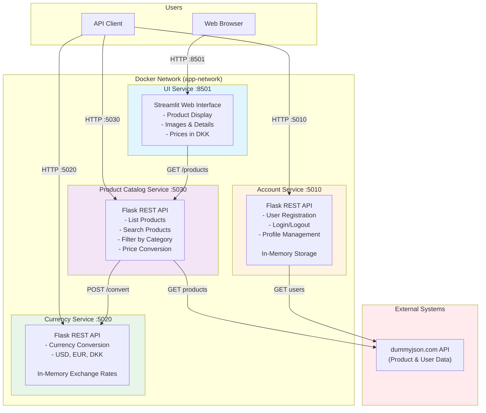
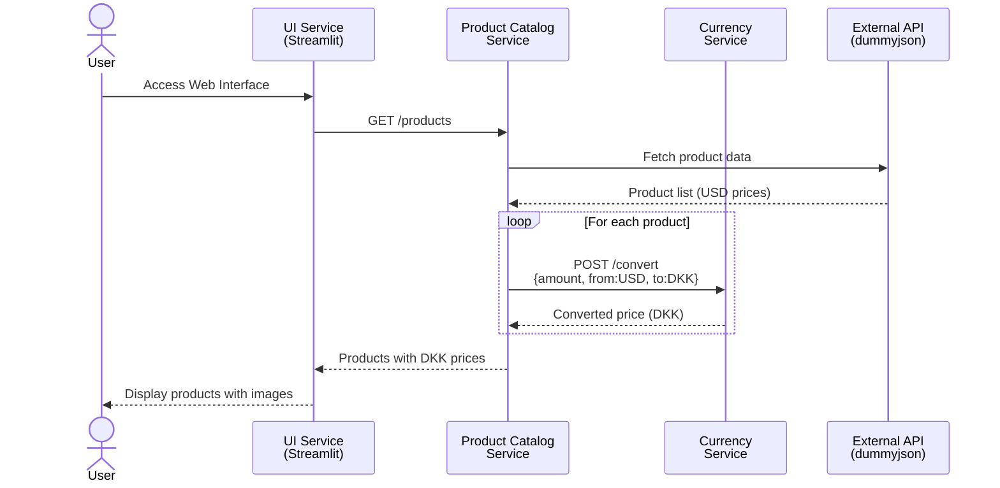
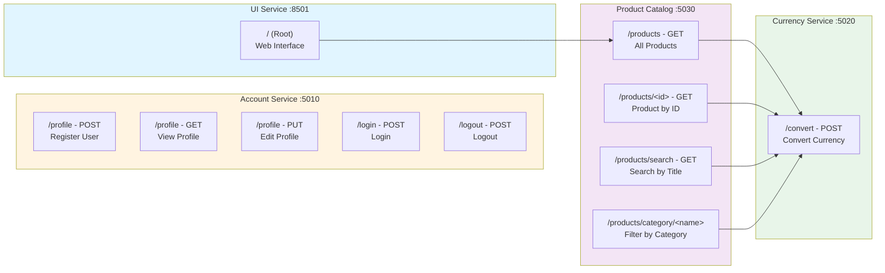
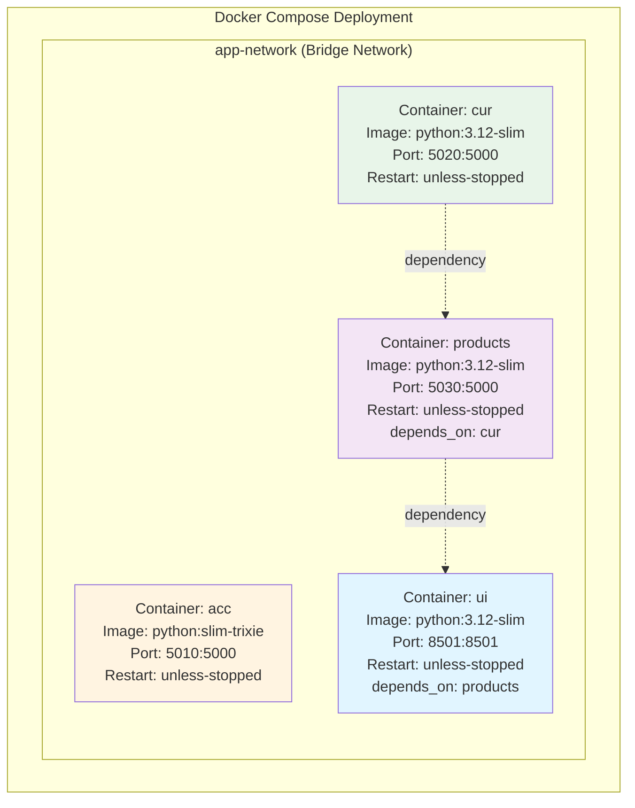
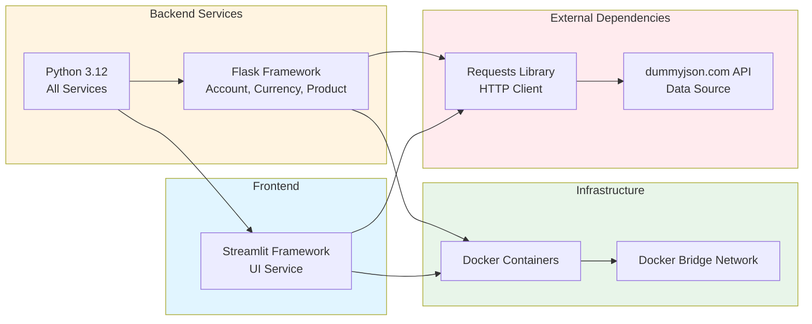
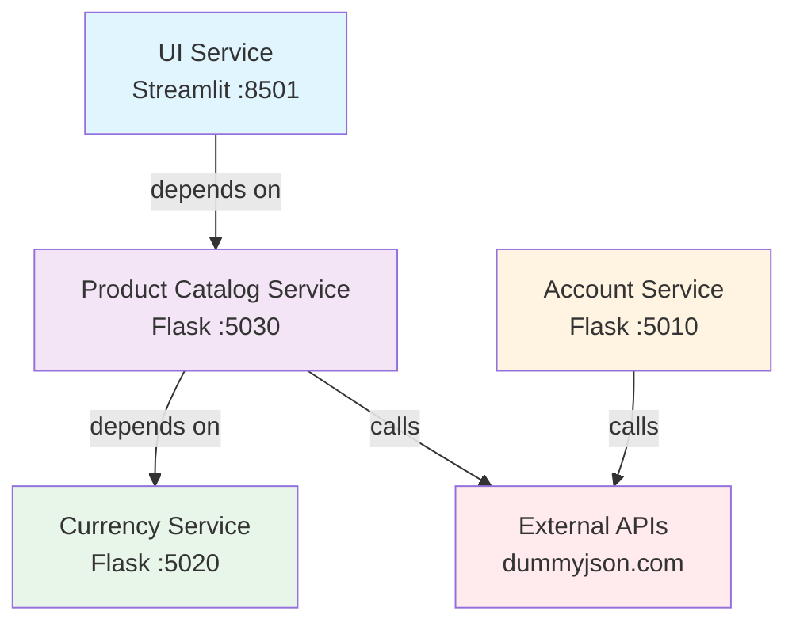

# Shopping Site Microservices Architecture

This document provides a comprehensive architectural overview of the Shopping Site Microservices application.

## System Overview

The application consists of 4 microservices deployed using Docker:
- **Account Service**: User registration and authentication
- **Currency Service**: Currency conversion functionality
- **Product Catalog Service**: Product listing and management
- **UI Service**: Web-based user interface (Streamlit)

## Architecture Diagram



## Service Communication Flow



## API Endpoints



## Container Architecture



## Technology Stack



## Data Flow Architecture


## Service Dependencies



## Key Architectural Characteristics

### Communication Pattern
- **Synchronous HTTP/REST**: All inter-service communication uses REST APIs
- **No Message Queues**: No asynchronous messaging implemented
- **Docker DNS**: Services discover each other via container names

### Data Storage
- **Account Service**: In-memory list (planned migration to SQLite)
- **Currency Service**: In-memory dictionary with static exchange rates
- **Product Catalog**: External API (dummyjson.com) - no local storage
- **No Persistent Database**: All data is volatile and lost on restart

### Scalability
- **Independent Services**: Each service can be scaled independently
- **Stateless Design**: Services don't maintain session state
- **Docker Orchestration**: Uses Docker Compose for local deployment

### Security Considerations
- **Authentication**: Account service uses Authorization header
- **No API Gateway**: Services exposed directly on different ports
- **Plain Text Data**: Credentials stored in-memory without encryption
- **No HTTPS**: All communication over HTTP

### External Dependencies
- **dummyjson.com**: Provides product and user seed data
- **Single Point of Failure**: External API unavailability affects service

## Deployment Instructions

1. **Prerequisites**: Docker and Docker Compose installed

2. **Start Services**:
   ```bash
   docker-compose up
   ```

3. **Access Points**:
   - Web UI: http://localhost:8501
   - Account API: http://localhost:5010
   - Currency API: http://localhost:5020
   - Product API: http://localhost:5030

4. **Service Startup Order**:
   - Currency Service starts first
   - Product Catalog Service (depends on Currency)
   - UI Service (depends on Product Catalog)
   - Account Service (independent)

## Future Enhancement Opportunities

1. **Persistent Storage**: Migrate to SQLite or PostgreSQL
2. **API Gateway**: Add central routing and authentication layer
3. **Caching**: Implement Redis for product and currency data
4. **Message Queue**: Add RabbitMQ/Kafka for async operations
5. **Service Discovery**: Implement Consul or Eureka
6. **Load Balancing**: Add nginx or Traefik
7. **Monitoring**: Integrate Prometheus and Grafana
8. **Logging**: Centralized logging with ELK stack
9. **Security**: Add OAuth2, HTTPS, secret management
10. **Resilience**: Implement circuit breakers and retry patterns
