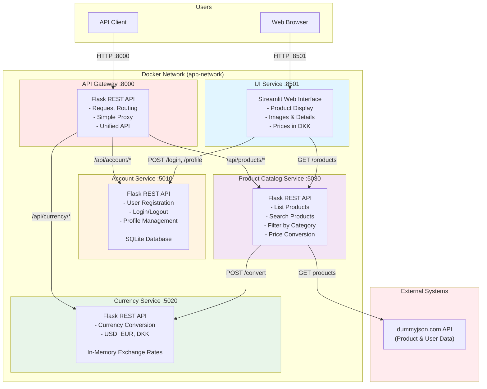
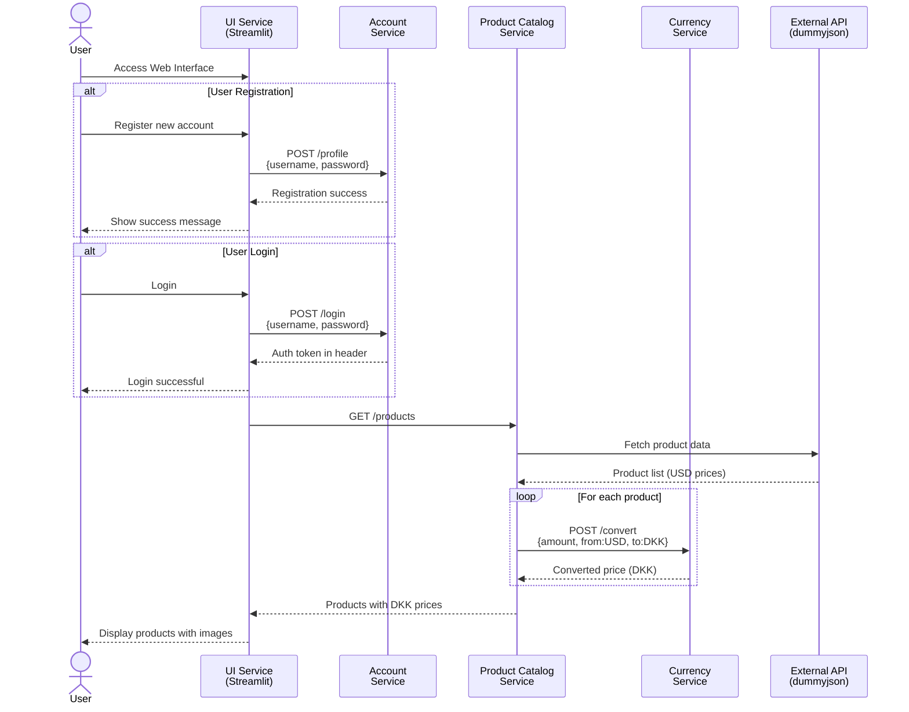
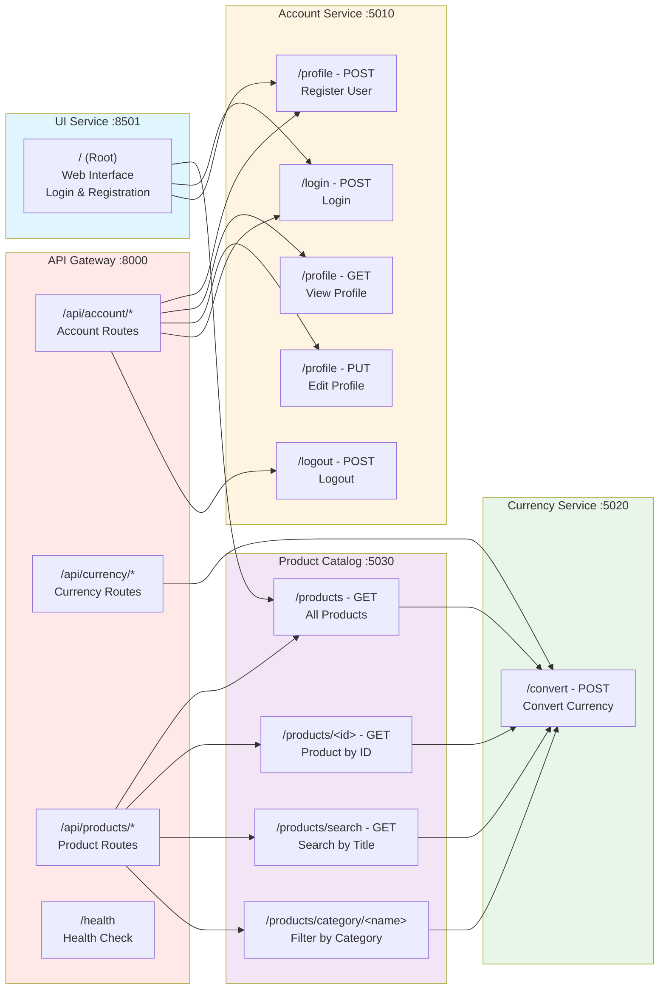
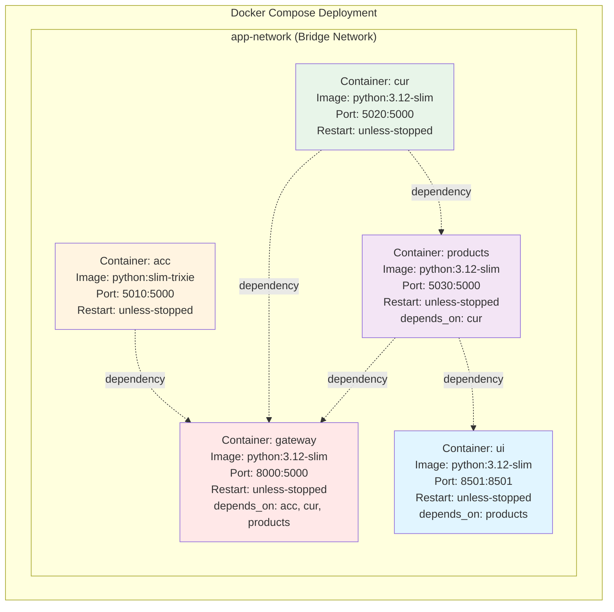
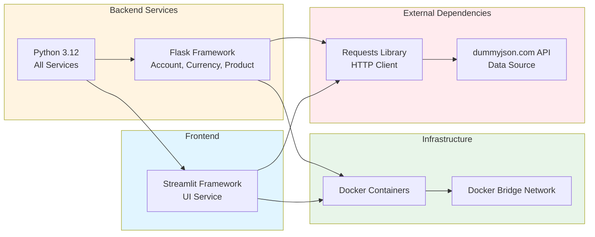
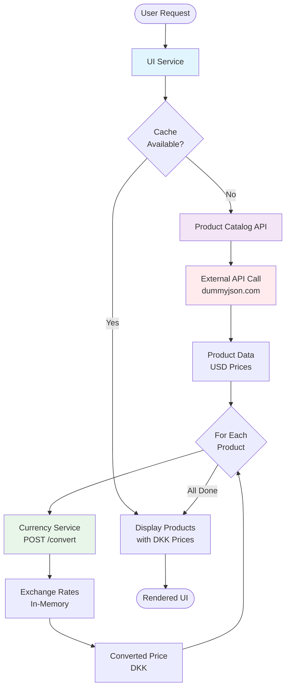
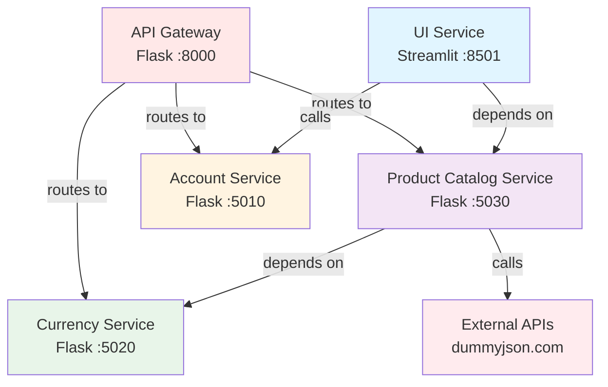

# Shopping Site Microservices Architecture

This document provides a comprehensive architectural overview of the Shopping Site Microservices application.

## System Overview

The application consists of 5 microservices deployed using Docker:
- **API Gateway**: Central routing and entry point for all services
- **Account Service**: User registration and authentication (modularized with separate database layer)
- **Currency Service**: Currency conversion functionality
- **Product Catalog Service**: Product listing and management
- **UI Service**: Web-based user interface (Streamlit)

## Architecture Diagram



## Service Communication Flow



## API Endpoints



## Container Architecture



## Technology Stack



## Data Flow Architecture



## Service Dependencies



## Key Architectural Characteristics

### Communication Pattern
- **API Gateway Pattern**: Simple central entry point routing requests to services
- **Synchronous HTTP/REST**: All inter-service communication uses REST APIs
- **No Message Queues**: No asynchronous messaging implemented
- **Docker DNS**: Services discover each other via container names
- **Simple Proxy**: Gateway calls services directly and returns responses

### Data Storage
- **Account Service**: SQLite database with modularized database layer in `database.py`
  - Separate database module for improved code organization
  - Persistent storage in `users.db` file
  - Schema: `users` table with id, username, password
  - Functions: `init_db()`, `get_db_connection()`, `find_user_by_username()`, `add_user()`, `get_all_users()`
- **Currency Service**: In-memory dictionary with static exchange rates
- **Product Catalog**: External API (dummyjson.com) - no local storage
- **Partial Persistence**: User data persists between restarts, product/currency data is volatile

### Scalability
- **Independent Services**: Each service can be scaled independently
- **Stateless Design**: Services don't maintain session state
- **Docker Orchestration**: Uses Docker Compose for local deployment

### Security Considerations
- **Authentication**: Account service uses Authorization header
- **API Gateway**: Simple central entry point on port 8000, services also exposed on individual ports
- **Minimal Error Handling**: Gateway returns responses as-is from services
- **Plain Text Data**: Credentials stored without encryption
- **No HTTPS**: All communication over HTTP

### External Dependencies
- **dummyjson.com**: Provides product seed data
- **Single Point of Failure**: External API unavailability affects Product Catalog Service

## Deployment Instructions

1. **Prerequisites**: Docker and Docker Compose installed

2. **Start Services**:
   ```bash
   docker-compose up
   ```

3. **Access Points**:
   - API Gateway: http://localhost:8000
   - Web UI: http://localhost:8501
   - Account API: http://localhost:5010 (or via Gateway: http://localhost:8000/api/account/*)
   - Currency API: http://localhost:5020 (or via Gateway: http://localhost:8000/api/currency/*)
   - Product API: http://localhost:5030 (or via Gateway: http://localhost:8000/api/products/*)

4. **Service Startup Order**:
   - Account, Currency Services start first (independent)
   - Product Catalog Service (depends on Currency)
   - API Gateway (depends on Account, Currency, Product Catalog)
   - UI Service (depends on Product Catalog)

## Future Enhancement Opportunities

1. **Enhanced Storage**: Migrate Product/Currency services to persistent storage
2. **Gateway Authentication**: Add JWT/OAuth2 authentication at gateway level
3. **Caching**: Implement Redis for product and currency data
4. **Message Queue**: Add RabbitMQ/Kafka for async operations
5. **Service Discovery**: Implement Consul or Eureka
6. **Load Balancing**: Add nginx or Traefik
7. **Monitoring**: Integrate Prometheus and Grafana
8. **Logging**: Centralized logging with ELK stack
9. **Security**: Add OAuth2, HTTPS, secret management
10. **Resilience**: Implement circuit breakers and retry patterns
