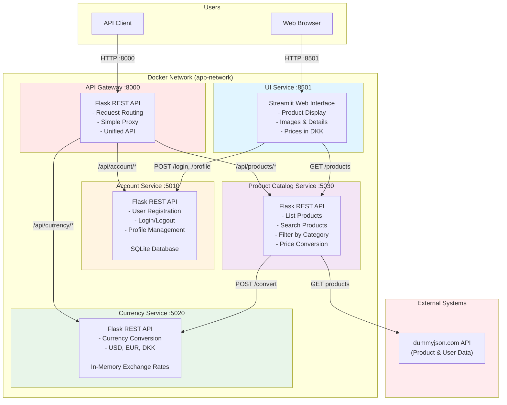
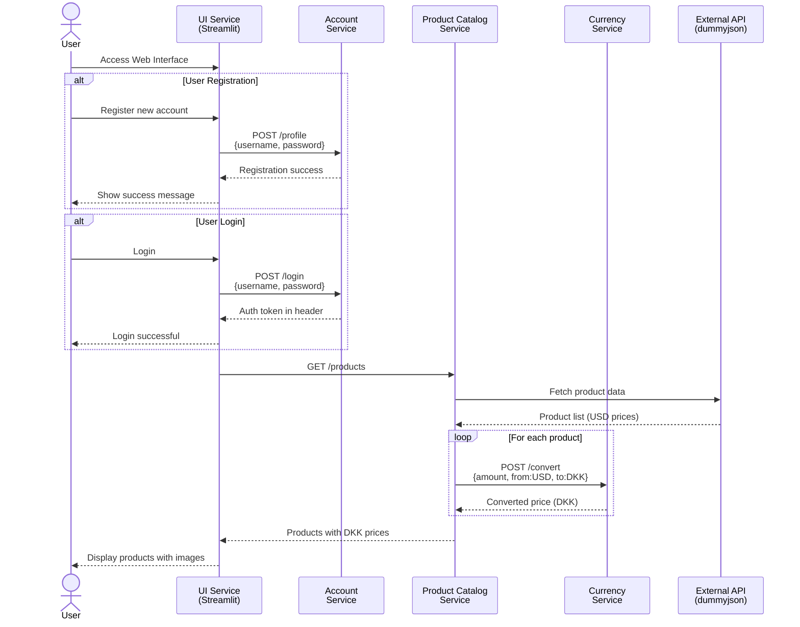
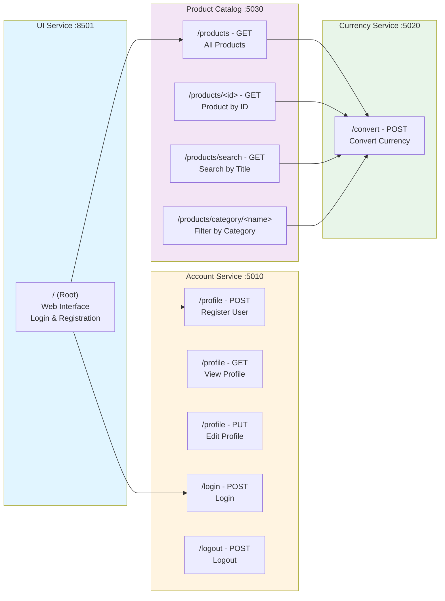
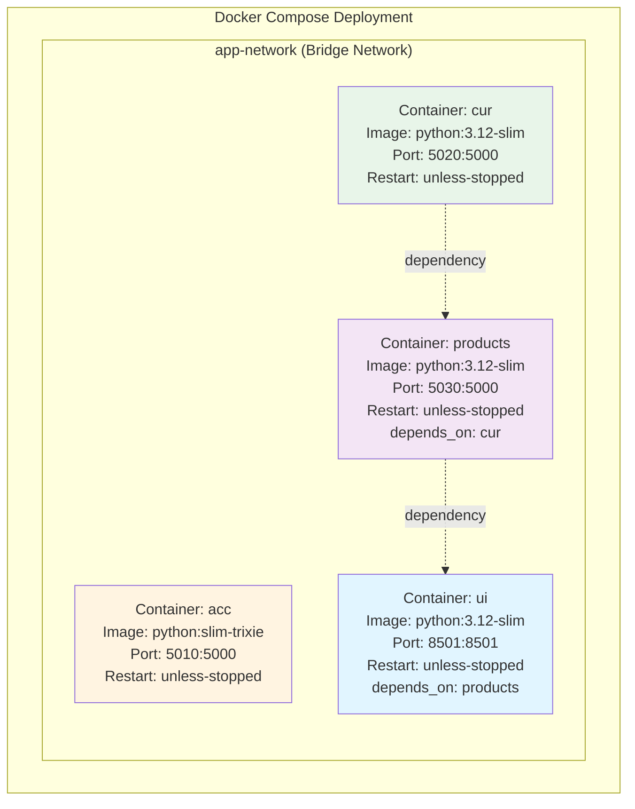
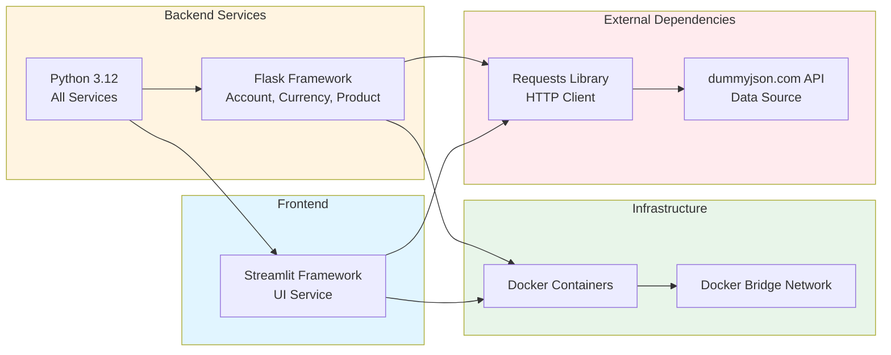
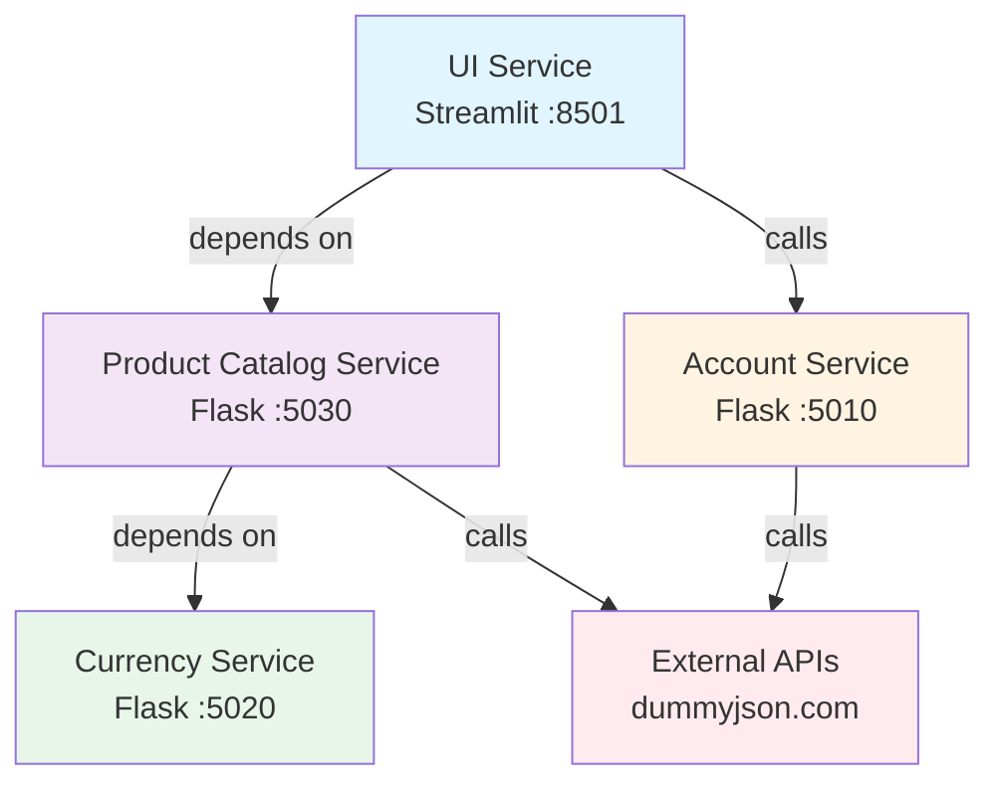

# Shopping Site Microservices Arkitektur

Dette dokument giver et omfattende arkitektonisk overblik over Shopping Site Microservices applikationen.

## System Oversigt

Applikationen består af 5 microservices deployed ved hjælp af Docker:
- **API Gateway**: Central routing og indgangspunkt for alle services
- **Account Service**: Brugerregistrering og autentificering (modulariseret med separat database lag)
- **Currency Service**: Valutakonverteringsfunktionalitet
- **Product Catalog Service**: Produktlisting og administration
- **UI Service**: Web-baseret brugerinterface (Streamlit)

## Arkitektur Diagram



## Service Kommunikationsflow



## API Endpoints



## Container Arkitektur



## Technology Stack



## Data Flow Arkitektur


## Service Dependencies



## Nøgle Arkitektoniske Karakteristika

### Kommunikationsmønster
- **API Gateway Mønster**: Simpelt centralt indgangspunkt routing requests til services
- **Synkron HTTP/REST**: Al inter-service kommunikation bruger REST APIs
- **Ingen Message Queues**: Ingen asynkron messaging implementeret
- **Docker DNS**: Services opdager hinanden via container navne
- **Simple Proxy**: Gateway kalder services direkte og returnerer responses

### Data Lagring
- **Account Service**: SQLite database med modulariseret database lag i `database.py`
  - Separat database modul for forbedret kodeorganisering
  - Persistent lagring i `users.db` fil
  - Schema: `users` tabel med id, username, password
  - Funktioner: `init_db()`, `get_db_connection()`, `find_user_by_username()`, `add_user()`, `get_all_users()`
- **Currency Service**: In-memory dictionary med statiske exchange rates
- **Product Catalog**: External API (dummyjson.com) - ingen lokal lagring
- **Delvis Persistence**: Brugerdata persisterer mellem genstart, produkt/valutadata er volatil

### Skalerbarhed
- **Uafhængige Services**: Hver service kan skaleres uafhængigt
- **Stateless Design**: Services vedligeholder ikke session state
- **Docker Orchestration**: Bruger Docker Compose til lokal deployment

### Sikkerhedsovervejelser
- **JWT Autentificering**: Account service bruger Flask-JWT-Extended til token-baseret autentificering
  - JWT tokens genereres ved login og returneres i Authorization header som `Bearer <token>`
  - Beskyttede endpoints valideres med `@jwt_required()` decorator
  - Secret key gemt i `.env` fil (ikke committed til git)
- **API Gateway**: Simpelt centralt indgangspunkt på port 8000, services også eksponeret på individuelle porte
  - Gateway forwarder JWT tokens korrekt i Authorization header
- **Minimal Fejlhåndtering**: Gateway returnerer responses som de er fra services
- **Password Storage**: Passwords gemmes i plaintext i SQLite (bør bruge hashing i produktion)
- **Ingen HTTPS**: Al kommunikation over HTTP (bør bruge HTTPS i produktion)

### Eksterne Afhængigheder
- **dummyjson.com**: Leverer produkt seed data
- **Single Point of Failure**: External API utilgængelighed påvirker Product Catalog Service

## Deployment Instruktioner

1. **Forudsætninger**: Docker og Docker Compose installeret

2. **Start Services**:
   ```bash
   docker-compose up
   ```

3. **Adgangspunkter**:
   - API Gateway: http://localhost:8000
   - Web UI: http://localhost:8501
   - Account API: http://localhost:5010 (eller via Gateway: http://localhost:8000/api/account/*)
   - Currency API: http://localhost:5020 (eller via Gateway: http://localhost:8000/api/currency/*)
   - Product API: http://localhost:5030 (eller via Gateway: http://localhost:8000/api/products/*)

4. **Service Opstartsrækkefølge**:
   - Account, Currency Services starter først (uafhængige)
   - Product Catalog Service (afhænger af Currency)
   - API Gateway (afhænger af Account, Currency, Product Catalog)
   - UI Service (afhænger af Product Catalog)

## Fremtidige Forbedringsmuligheder

1. **Password Hashing**: Implementer bcrypt eller argon2 til sikker password lagring
2. **HTTPS/TLS**: Tilføj SSL certificates til sikker kommunikation
3. **Forbedret Lagring**: Migrer Product/Currency services til persistent lagring
4. **Token Refresh**: Implementer refresh tokens til længere sessioner
5. **Caching**: Implementer Redis til produkt og valutadata
6. **Message Queue**: Tilføj RabbitMQ/Kafka til async operationer
7. **Service Discovery**: Implementer Consul eller Eureka
8. **Load Balancing**: Tilføj nginx eller Traefik
9. **Monitoring**: Integrer Prometheus og Grafana
10. **Logging**: Centraliseret logging med ELK stack
11. **Resilience**: Implementer circuit breakers og retry patterns
