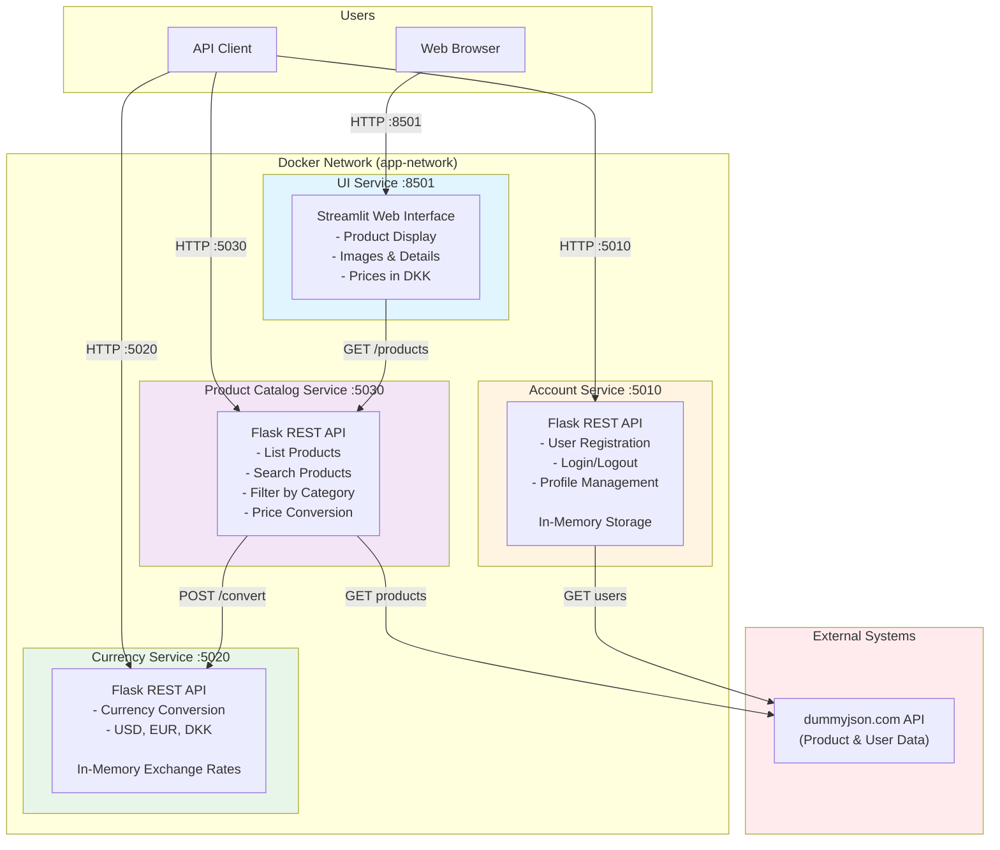
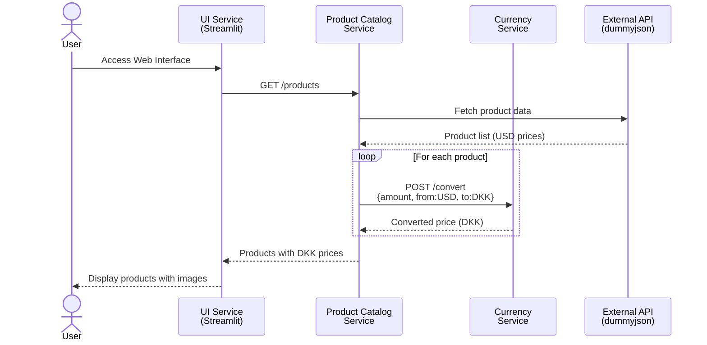
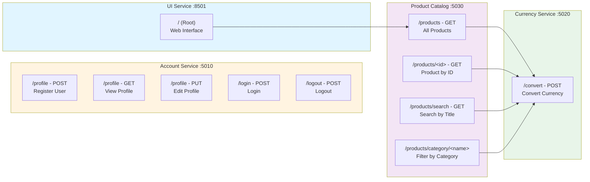
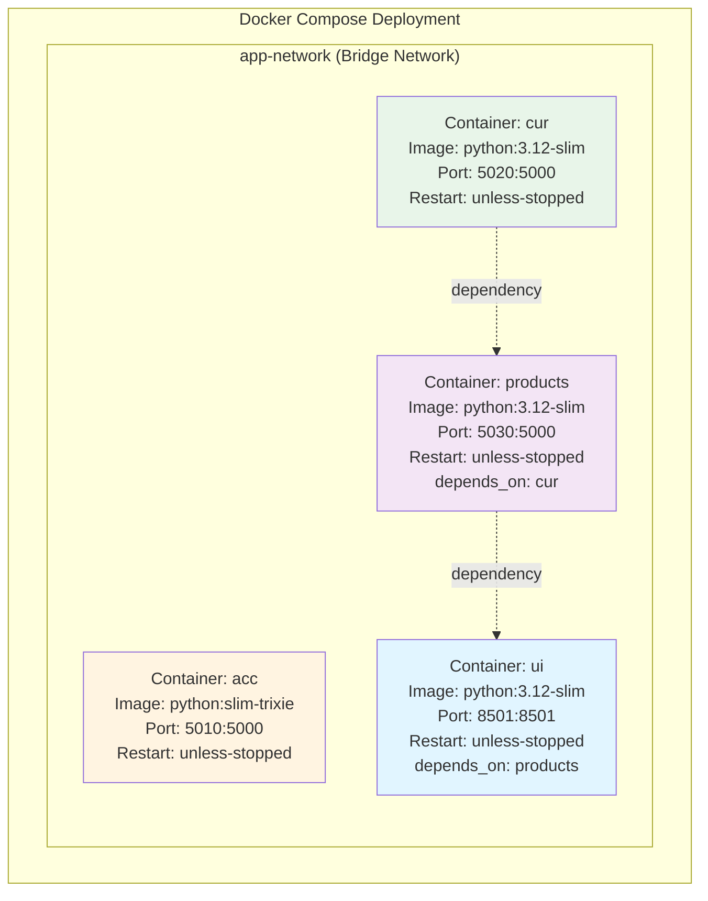
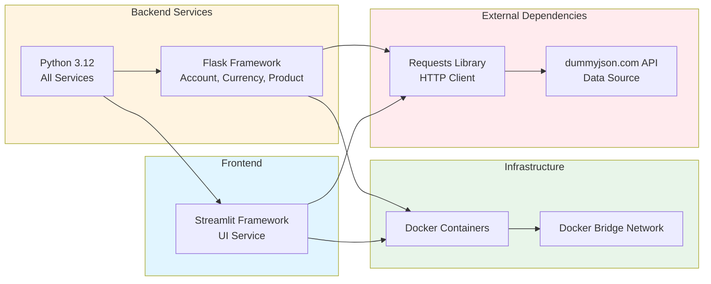
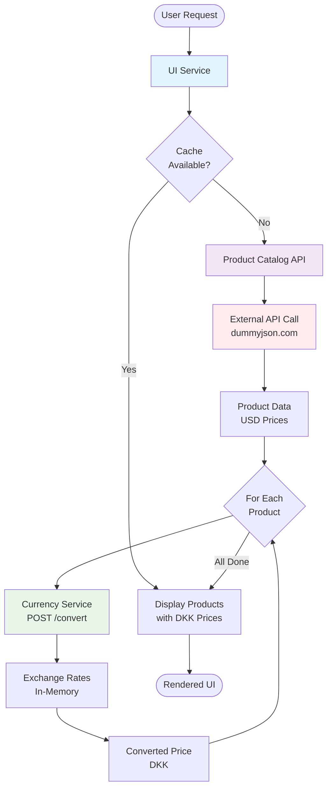
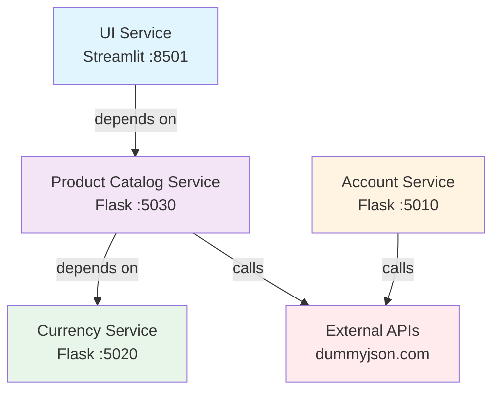

# Shopping Site Microservices Arkitektur

Dette dokument giver et omfattende arkitektonisk overblik over Shopping Site Microservices applikationen.

## System Oversigt

Applikationen består af 4 microservices deployed ved hjælp af Docker:
- **Account Service**: Brugerregistrering og autentificering
- **Currency Service**: Valutakonverteringsfunktionalitet
- **Product Catalog Service**: Produktlisting og administration
- **UI Service**: Web-baseret brugerinterface (Streamlit)

## Arkitektur Diagram



## Service Kommunikationsflow



## API Endpoints



## Container Arkitektur



## Technology Stack



## Data Flow Arkitektur



## Service Dependencies



## Nøgle Arkitektoniske Karakteristika

### Kommunikationsmønster
- **Synkron HTTP/REST**: Al inter-service kommunikation bruger REST APIs
- **Ingen Message Queues**: Ingen asynkron messaging implementeret
- **Docker DNS**: Services opdager hinanden via container navne

### Data Lagring
- **Account Service**: In-memory liste (planlagt migration til SQLite)
- **Currency Service**: In-memory dictionary med statiske exchange rates
- **Product Catalog**: External API (dummyjson.com) - ingen lokal lagring
- **Ingen Persistent Database**: Al data er volatil og går tabt ved restart

### Skalerbarhed
- **Uafhængige Services**: Hver service kan skaleres uafhængigt
- **Stateless Design**: Services vedligeholder ikke session state
- **Docker Orchestration**: Bruger Docker Compose til lokal deployment

### Sikkerhedsovervejelser
- **Autentificering**: Account service bruger Authorization header
- **Ingen API Gateway**: Services eksponeres direkte på forskellige porte
- **Plain Text Data**: Credentials gemmes in-memory uden kryptering
- **Ingen HTTPS**: Al kommunikation over HTTP

### Eksterne Afhængigheder
- **dummyjson.com**: Leverer produkt og bruger seed data
- **Single Point of Failure**: External API utilgængelighed påvirker servicen

## Deployment Instruktioner

1. **Forudsætninger**: Docker og Docker Compose installeret

2. **Start Services**:
   ```bash
   docker-compose up
   ```

3. **Adgangspunkter**:
   - Web UI: http://localhost:8501
   - Account API: http://localhost:5010
   - Currency API: http://localhost:5020
   - Product API: http://localhost:5030

4. **Service Opstartsrækkefølge**:
   - Currency Service starter først
   - Product Catalog Service (afhænger af Currency)
   - UI Service (afhænger af Product Catalog)
   - Account Service (uafhængig)

## Fremtidige Forbedringsmuligheder

1. **Persistent Storage**: Migrer til SQLite eller PostgreSQL
2. **API Gateway**: Tilføj central routing og autentificeringslag
3. **Caching**: Implementer Redis til produkt og valutadata
4. **Message Queue**: Tilføj RabbitMQ/Kafka til async operationer
5. **Service Discovery**: Implementer Consul eller Eureka
6. **Load Balancing**: Tilføj nginx eller Traefik
7. **Monitoring**: Integrer Prometheus og Grafana
8. **Logging**: Centraliseret logging med ELK stack
9. **Security**: Tilføj OAuth2, HTTPS, secret management
10. **Resilience**: Implementer circuit breakers og retry patterns
